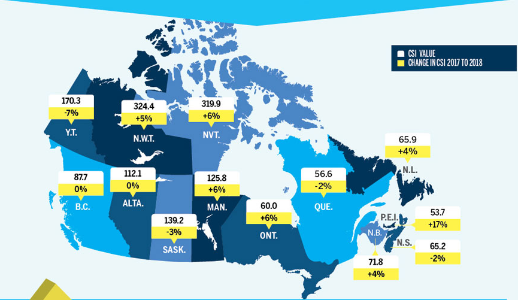
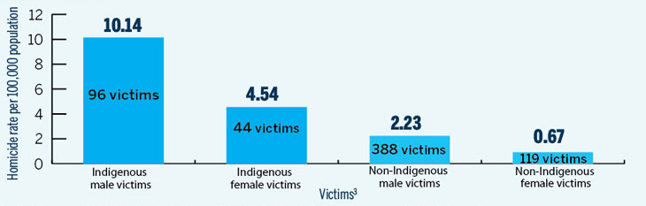
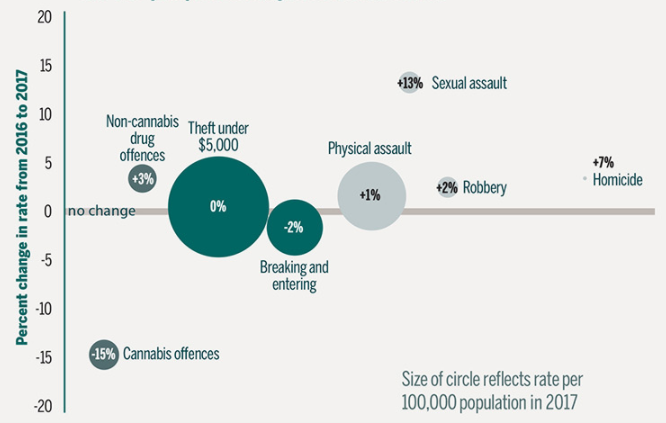

# Project 2 – Incarceration Trends in Canada 				 September 2020 

'https://vivisantosa.github.io/Project2/index.html'

###	Team members: 
-	Eben Haezer 
-	Momotaz Mahin Khan
-	Sheri Shojaie
-	Vivi Santosa

###	Project description / outline: 
The goal of this project is to extract data from Correctional Services Canada(CSC), perform analysis on the Offender Profiles data, and communicate the findings through interactive data visualizations.  
Project components will include extraction of the data from open Canadian CSC data, transformation, and loading of the data into a relationship database. Data visualizations will be created using Leaflet and Plotly, and delivered to the client using Flask web application.   

### Data sources:  
-	Open Canada – Correctional Services Canada, Offender Profile 
  https://open.canada.ca/data/en/dataset/106fbf2d-bfdb-4e82-9aef-7ad46bf6ffd2    
-	StatCan – Population Demographic data   
  https://www150.statcan.gc.ca/n1/en  

###	Application Schema:  
 

###	Draft of tasks  
•	ETL
•	Extraction: API / CSV [Momotaz, Vivi]
•	Transformation: Pandas in Python [Momotaz, Sheri]
•	Loading: Table Schemata and loading into PostgreSQL [Sheri]
•	Web application (HTML, JS, CSS)
•	Query database and pass CSC and StatCan data into HTML [Eben, Vivi]
•	Visualizations [all]
  (images illustrative) 

  •	Interactive Map: D3 and Leaflet   
    Interactive component: user hovers to see popup on each province; clicks to see province-specific information in other charts 
      

  •	Interactive bar chart: Plotly  
    Interactive component: user clicks on selector to see a specific gender/race  
      

  •	Interactive scatter plot: Plotly  
    Interactive component: user can select year (between 2013-2018) to see year-specific trends   
       

#### Credits 
- Leaflet
  https://leafletjs.com/
- Canadian Cloropleth map 
  https://exploratory.io/map?lang=en
