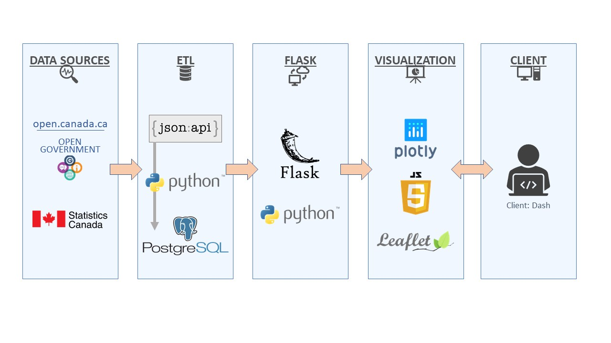
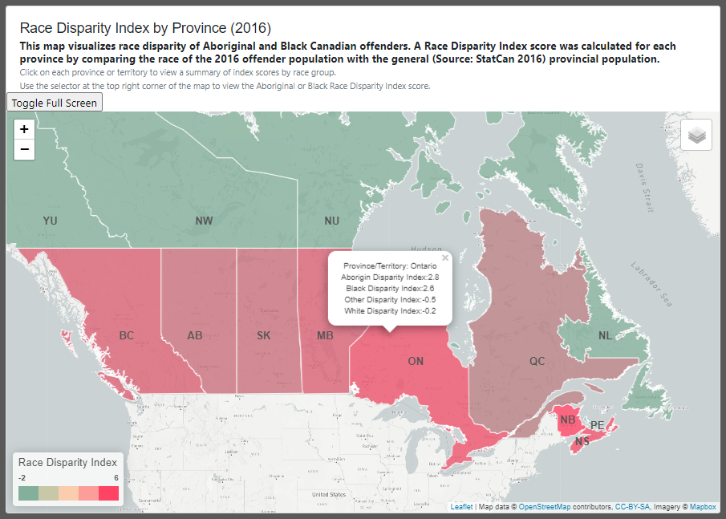
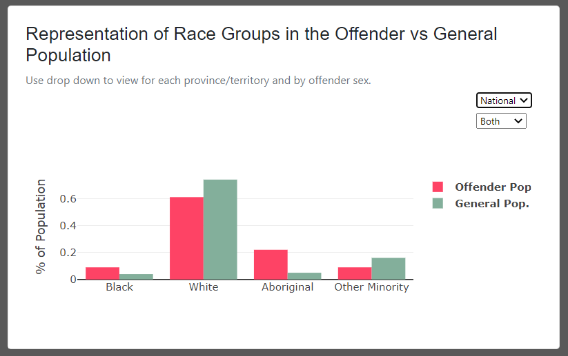
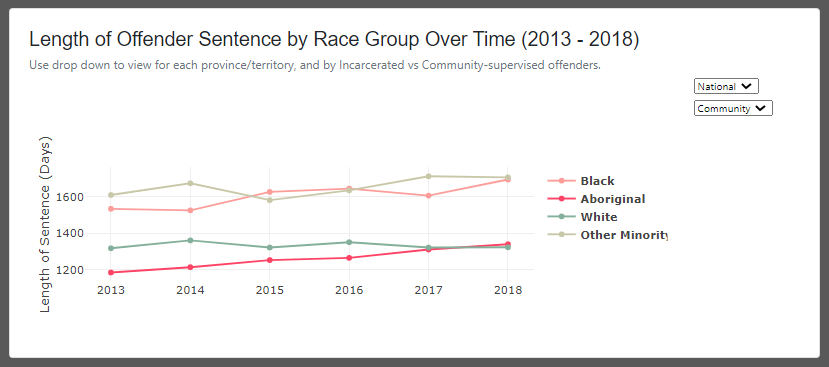

# Project 2 – Race Disparity in Canada's Offender Population 				 
## A look at Correctional Services Canada's (CSC) offender profiles (2012-2018)
September 2020

### 'https://vivisantosa.github.io/Project2/index.html'

##	Team members: 
-	Eben Haezer 
-	Momotaz Mahin Khan
-	Sheri Shojaie
-	Vivi Santosa

##	Project description / outline: 
The goal of this project was to extract data from Correctional Services Canada(CSC), perform analysis on the Offender Profiles data, make a comparison of race group representation (offender population vs the general population) across the provinces in Canada, and communicate the findings through interactive data visualizations.  
Project components included extraction of the data from Open Canada and StatCan, transformation & analysis, loading of the data into a relational database, and visualization of the findings on a browser app. Data visualizations were created using Leaflet and Plotly, and delivered to the client using Flask web application.   

## Data sources:  
-	Open Canada – Correctional Services Canada, Offender Profile (2012-2018) 
  https://open.canada.ca/data/en/dataset/106fbf2d-bfdb-4e82-9aef-7ad46bf6ffd2    
-	StatCan – Population Demographic data   
  https://www150.statcan.gc.ca/n1/en  

##	Application Schema:  
 

##	Application components  
•	Race Disparity Index by Province (2016)
  This cloropleth map visualizes race disparity of Aboriginal and Black Canadian offenders. 
  A Race Disparity Index score was calculated for each province by comparing the race of the 2016 offender population with the general provincial population. 
  (1) Each province or territory can be clicked to view a summary of index scores by race group 
  (2) Selector at the top right corner of the map can be used to view the Aboriginal or Black Race Disparity Index score
  
    

•	Representation of Race Groups in the Offender vs General Population (2016) 
  The drop down allows visualization of data by province/territory and by offender sex
  
    
  
  
•	Length of Offender Sentence by Race Group Over Time (2013 - 2018) 
  The drop down allows visualization of data by province/territory and by Incarcerated vs Community-supervised offenders
  
    
  
  

#### Credits 
- Leaflet
  https://leafletjs.com/
- Canadian Cloropleth map 
  https://exploratory.io/map?lang=en
